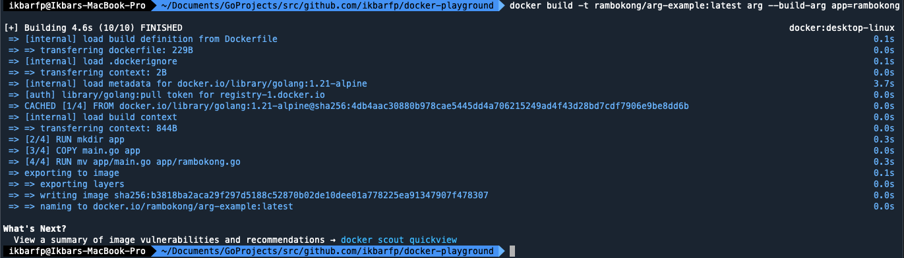

# `ARG` Instruction
`ARG` stands for _arguments_ is an instruction used to define variables that can be passed/changed by the user during 
the Docker build process.

- To use it, you can add the command `--build-arg {your_key}={your_value}.`
- `ARG` is **only used during build time**, meaning that once the Docker Container is running, `ARG` is no longer used. 
This is different from `ENV`, which is used when the container is running.
- Accessing variables from `ARG` is similar to accessing variables from `ENV`, using `${ARG_NAME}`.

## Format Instruction
```shell
ARG
```

### ***example***
- Create an argument variable
```shell
ARG MY_ARG
```

- Create an argument with default value if the user didn't pass the `--build-arg {your_key}={your_value}` value 
when building new image
```shell
ARG MY_ARG=MY_VALUE
```

## Step by Step
1. Build new image based on our Dockerfile with some custom arg of `app`
```shell
docker build -t rambokong/arg-example:latest arg --build-arg app=rambokong
```


2. See all the image to make sure our image is created properly
```shell
docker image ls
```

3. Create a container from the image with custom port to see the differences
```shell
docker container create --name arg-example -p 8080:8080 rambokong/arg-example
```

4. See all the container to make sure our container is created properly
```shell
docker container ls -a
```

5. Start the container
```shell
docker container start arg-example
```

6. Connect to the container
```shell
docker container exec -it arg-example /bin/sh
```

7. See file names of your `.go` file, it should be renamed by value you have been passed on `ARG` instruction