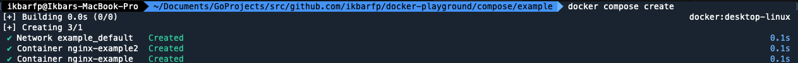
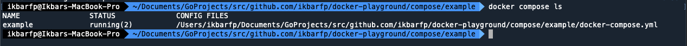
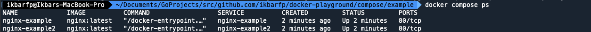
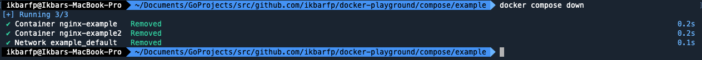
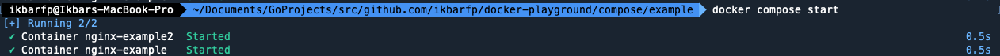
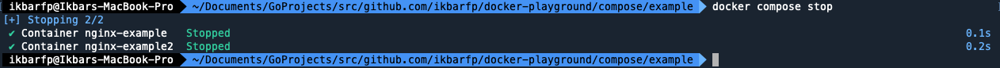
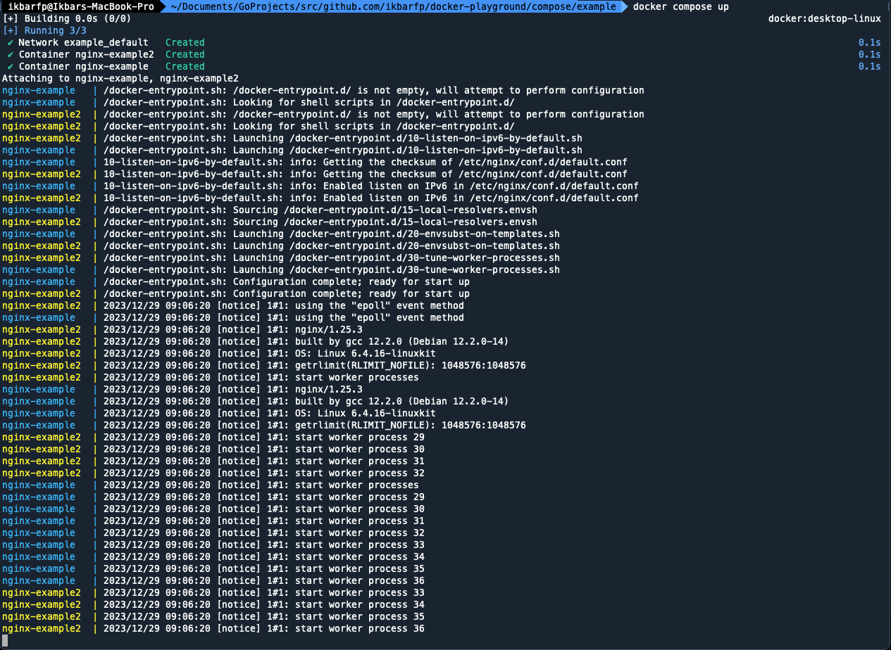

# Docker Compose
This document contains all information which related to docker compose

## Command : 
> [!WARNING]  
> Before you use `docker compose` command, you need to be at the same level as the `docker-compose.yml` file is located.

<br>  

- `docker compose create` : create new container(s) based on `docker-compose.yml` file.  



- `docker compose ls` : list all running projects based on `docker-compose.yml` file.



- `docker compose ps` : list all container that has been created based on `docker-compose.yml` file.



- `docker compose down` : **stop** and **remove** all **container** and **network** that has been used 
 by all container based on `docker-compose.yml` file.



- `docker compose start` : start all container based on `docker-compose.yml` file.



- `docker compose stop` : **stop** all container based on `docker-compose.yml` file.



- `docker compose up` : **create** and **start** all container based on `docker-compose.yml` file which will blocked
 until you give interrupt/termination signal 



## [Ports](https://docs.docker.com/compose/compose-file/compose-file-v3/#ports)
- Long syntax example : 
```shell
# this means you expose your container's port 80 through the world via port 8080 with protocol TCP
services:
  nginx-port1:
    container_name: nginx-port1
    image: nginx:latest
    ports:
      - protocol: tcp
        published: 8080
        target: 80
```

- Short syntax example : 
```shell
# this means you expose your container's port 80 through the world via port 8081
services:
  nginx-port1:
    container_name: nginx-port1
    image: nginx:latest
    ports:
      - "8081:80"
```

## [Bind Mounts](https://docs.docker.com/compose/compose-file/compose-file-v3/#volumes)
- Long syntax example :
```shell
services:
  mongodb1:
    container_name: mongodb1
    image: mongo:latest
    ports:
      - "27017:27017"
    .
    .
    .
    # Use long syntax for volumes object declarations
    volumes:
      - type: bind
        source: ./data-mongo2  # your host's location data
        target: /data/db # your container's location data
        volume:
          nocopy: true
```

- Short syntax example : 
```shell
services:
  mongodb1:
    container_name: mongodb1
    image: mongo:latest
    ports:
      - "27017:27017"
    .
    .
    .
    # with format {HOST_LOC_DATA}:{CONTAINER_LOC_DATA}
    volumes:
  - "./data-mongo1:/data/db"

```

## [Volumes](https://docs.docker.com/compose/compose-file/compose-file-v3/#volumes)
- Create volume example : 
```shell
volumes:
  mongo-data1:
    name: mongo-data1

  mongo-data2:
    name: mongo-data2
```

## [Networks](https://docs.docker.com/compose/compose-file/compose-file-v3/#networks)
- Create network example : 
```shell
networks:
  network-example:
    name: network-example
    driver: bridge
```

## [Depends On](https://docs.docker.com/compose/compose-file/compose-file-v3/#depends_on)
- Example :
```shell
services:
  #1. Container that need to created first
  mongodb-example:
    container_name: mongodb-example
    image: mongo:latest
    .
    .
    .

  #2. Container that depends on another container
  mongodb-express-example:
    container_name: mongodb-express-example
    image: mongo-express:latest
    .
    .
    .
    depends_on:
      - mongodb-example
```

## [Restart](https://docs.docker.com/compose/compose-file/compose-file-v3/#restart)
- Example : 
```shell
services:
  mongodb-express-example:
    container_name: mongodb-express-example
    image: mongo-express:latest
    .
    .
    .
    restart: always
```

## [Resources Limit](https://docs.docker.com/compose/compose-file/compose-file-v3/#resources)
- Example : 
```shell
services:
  redis:
    image: redis:alpine
    deploy:
      resources:
        limits: # Maximum resources that container can used
          cpus: '0.50'
          memory: 50M
        reservations: # Minimum resources that container can used
          cpus: '0.25'
          memory: 20M
```
