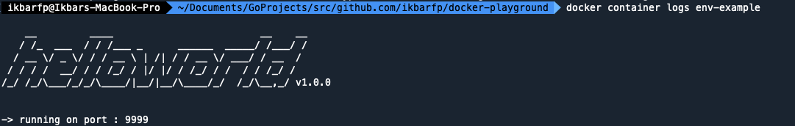
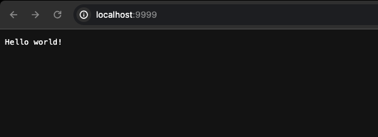

# `ENV` Instruction
`ENV` is an instruction used to modify environment variables, either during the build stage or when running within a Docker container.

- `ENV` defined in the `Dockerfile` can be reused using the syntax `${ENV_NAME}`.
- Environment variables created using the `ENV` instruction are stored in the Docker Image and can be viewed using 
the command `docker image inspect image_name`.
- Once the value of an environment variable is set, it can be changed during the creation of a Docker Container using 
the command `docker container create --env key_name=key_value`.

## Format Instruction
```shell
ENV {your_env_key}={your_env_value}
```

### ***example***
- Create new environment variable for application port
```shell
ENV APP_PORT=8080
```

- Define multiple environment variables
```shell
# single line declaration
ENV APP_PORT=9090 APP_HOST=localhost

# multiple line declaration
ENV APP_PORT=9999
ENV APP_HOST=localhost
```

## Step by step
1. Build new image based on our Dockerfile
```shell
docker build -t rambokong/env-example:latest env
```

2. See the details of image we've been created, to make sure this image is created properly
```shell
docker image inspect rambokong/env-example
```

3. See all the image to make sure our image is created properly
```shell
docker image ls
```

4. Create a container from the image with custom port to see the differences
```shell
docker container create --name env-example --env APP_PORT=9999 -p 9999:9999 rambokong/env-example
```

5. See all the container to make sure our container is created properly
```shell
docker container ls -a
```

6. Start the container
```shell
docker container start env-example
```

7. See the container logs to make sure our container is running. Probably you will see like this given image below :
```shell
docker container logs env-example
```


8. Access the `http://localhost:9999`. Probably you will see like this given image below :
