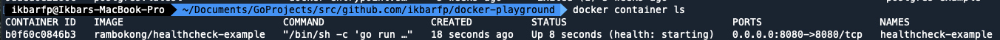
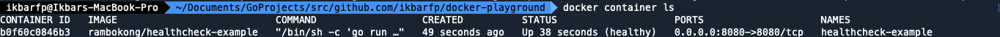
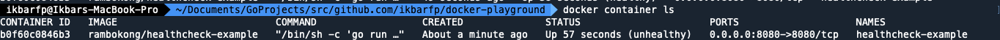

# `HEALTHCHECK` Instruction
`HEALTHCHECK` is an instruction used to inform Docker how to check whether a container is running properly or not.

- By default, `HEALTHCHECK` will have the `starting` status.
- If there is a `HEALTHCHECK` instruction, the container will automatically determine the `health` status.
- If the check returns success, it will be considered `healthy`.
- If the check returns failure, it will be considered `unhealthy`.

## Format Instruction
```shell
HEALTHCHECK {OPTIONS} CMD {COMMAND}
```

There is multiple `OPTIONS` :
- `--interval={DURATION}` : How often health checks are carried out in seconds. By default, it will be _**30s**_
- `--timeout={DURATION}` : How long the `CMD` instruction will be waited until it gets a response in seconds. 
By default, it will be _**30s**_
- `--start-period={DURATION}` : When `HEALTHCHECK` instruction will be executed first time in seconds. 
By default, it will be ***0s***
- `--retries=N` : Amount of consecutive retries after getting failed response. By default, it will be _**3**_ max retries  
<br>

> [!WARNING]  
> When defines `--start-period` please keep in mind with duration of booting up your project. It will be varied
depends on your language, dependencies and compiler or even your resources.

### ***example***
- Disable `HEALTHCHECK` 
```shell
HEALTHCHECK NONE
```

- Set interval period of
```shell

```

## Step by Step
1. Build new image based on our Dockerfile
```shell
docker build -t rambokong/healthcheck-example:latest healthcheck
```

2. See all the image to make sure our image is created properly
```shell
docker image ls
```

3. Create a container from the image with custom port to see the differences
```shell
docker container create --name healthcheck-example -p 8080:8080 rambokong/healthcheck-example
```

4. See all the container to make sure our container is created properly
```shell
docker container ls -a
```

5. Start the container
```shell
docker container start healthcheck-example
```

6. See the container health status. It should have `starting` status like given image below
```shell
docker container ls
```


7. After 5s (which our interval period as defined in `Dockerfile`), see the container health status. 
It should have `healthy` status like given image below
```shell
docker container ls
```


8. After 5s (which our interval period as defined in `Dockerfile`), see the container health status.
   It should have `unhealthy` status like given image below
```shell
docker container ls
```

