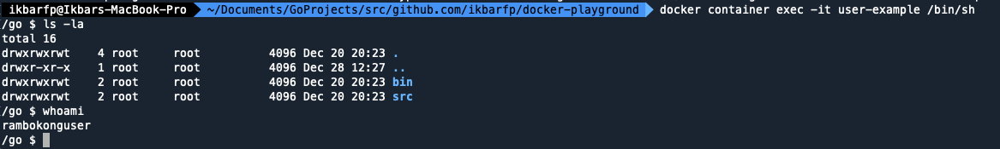

# `USER` Instruction
`USER` is an instruction used to change the user or user group when a Docker Image is executed.

- By default, Docker will use the `root` user.
- In some cases, there may be applications that should not run as the `root` user. In such cases, 
the `USER` instruction can be used to change the user.  
<br>

> [!WARNING]  
> Make sure you already create the user before using this instruction in its container

## Format Instruction
```shell
USER {user_name}:{user_group}
```

### ***example***
- Change user
```shell
USER rambokong
```

- Change user and his user group
```shell
USER rambokong:dev
```

## Step by Step
1. Build new image based on our Dockerfile
```shell
docker build -t rambokong/user-example:latest user
```

2. See all the image to make sure our image is created properly
```shell
docker image ls
```

3. Create a container from the image with custom port to see the differences
```shell
docker container create --name user-example -p 8080:8080 rambokong/user-example
```

4. See all the container to make sure our container is created properly
```shell
docker container ls -a
```

5. Start the container
```shell
docker container start user-example
```

6. Connect to the container
```shell
docker container exec -it user-example /bin/sh
```

7. Check directory to see if our `USER` command is work or not by typing `whoami` command like shown by image below

