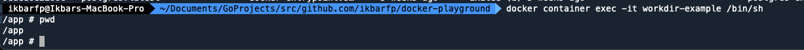

# `WORKDIR` Instruction
`WORKDIR` is an instruction to specify the directory/folder for executing `RUN`, `CMD`, `ENTRYPOINT`, `COPY`, and 
`ADD` instructions.

- If the specified `WORKDIR` does not exist, the directory will be automatically created. After specifying the `WORKDIR`
location, it becomes the place for executing subsequent instructions.
- If the `WORKDIR` location is a relative path, it will automatically enter the directory of the previous `WORKDIR`.
- `WORKDIR` can also be used as the initial path when entering the Docker container for the first time.
- You can state `WORKDIR` more than one in a single Dockerfile

## Format Instruction
```shell
WORKDIR {your_working_directory}
```

### ***example***
- Firstly, we state the working directory will be at `/app` (using absolute path)
```shell
# this will make the WORKDIR to /app
WORKDIR /app
```

- Secondly, we state working directory again at `docker` (using relative path)
```shell
# this will make the WORKDIR to /app/docker
WORKDIR docker
```

- Last, we state working directory again at `/home/app` (using absolute path, again)
```shell
# this will make the WORKDIR to /home/app
WORKDIR /home/app
```

## Step by Step
1. Build new image based on our Dockerfile
```shell
docker build -t rambokong/workdir-example:latest workdir
```

2. See all the image to make sure our image is created properly
```shell
docker image ls
```

3. Create a container from the image with custom port to see the differences
```shell
docker container create --name workdir-example -p 8080:8080 rambokong/workdir-example
```

4. See all the container to make sure our container is created properly
```shell
docker container ls -a
```

5. Start the container
```shell
docker container start workdir-example
```

6. Connect to the container
```shell
docker container exec -it workdir-example /bin/sh
```

7. Check directory to see if our `WORKDIR` command is work or not by typing `pwd` command like shown by image below

